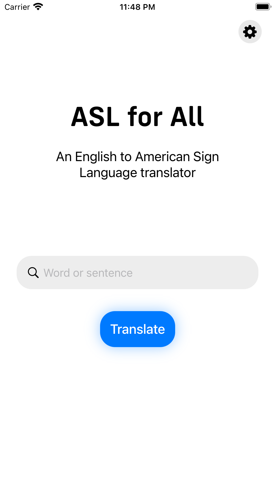
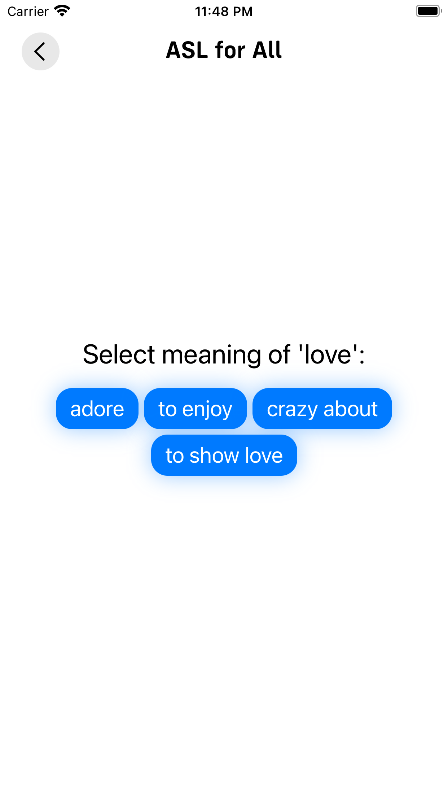
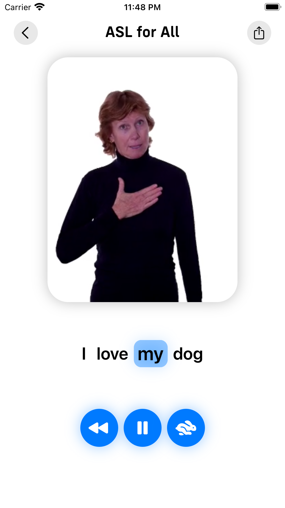

# ASL for All
ASL for All is an English to American Sign Language Translator.

## Demo
Input|Choose meaning|Translation
:-------------------------:|:-------------------------:|:-------------------------:
||

## How it works
ASL for All is an English to American Sign Language translator.

It uses videos from [SigningSavvy](https://www.signingsavvy.com/) and an English to ASL grammar translator to seamlessly translate English sentences to videos depicting American Sign Language.

The ASL grammar translator is a modified version of Harsh Bhavsar's English to ASL grammar algorithm (see [credits](https://github.com/thatcherclough/ASL-for-All#credits)), and this modified version (which can be found [here](https://github.com/thatcherclough/ASLGrammarTranslator)) is used in the custom ASL for All API.
This custom python API can be found in the "api" folder. More information about this API can be found in its [documentation](api/README.md).

Further development information:

While the Xcode project will compile, it will not run properly because an API base url is required when running ``pod install``. 

## Installation
ASL for All can be installed from the [App Store](https://apps.apple.com/us/app/asl-for-all/id1603768412).

## Credits
- [Harsh Bhavsar](https://github.com/harshbhavsar) for the algorithm used to convert English grammar to ASL grammar. The original can be found [here](https://github.com/harshbits/english-asl-algorithm), and the modified one used in the api can be found [here](https://github.com/thatcherclough/ASLGrammarTranslator).
- [SigningSavvy](https://www.signingsavvy.com/) for the ASL videos.

## Future Dev Plans
- Add a micophone buton when not typing
- Add report button / Update algorithm
- Store translations on remote end (API)
- Better concatenation
- Better video management (expecially with export)
- Better video player
- Keys for API
- Better loading animation
- VideoView PlayerItem ram handling
- Starting screen text cuts off
- Use GeometryReader everywhere

## License
[MIT](https://choosealicense.com/licenses/mit/)

Copyright 2022 © Thatcher Clough.
